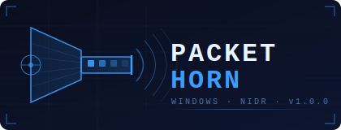
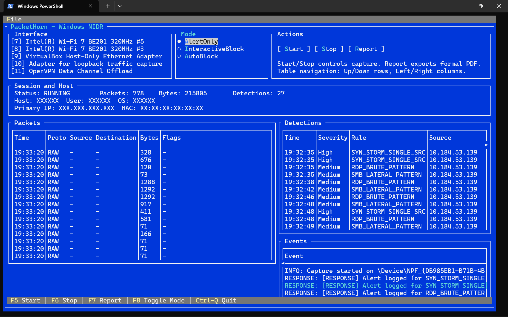
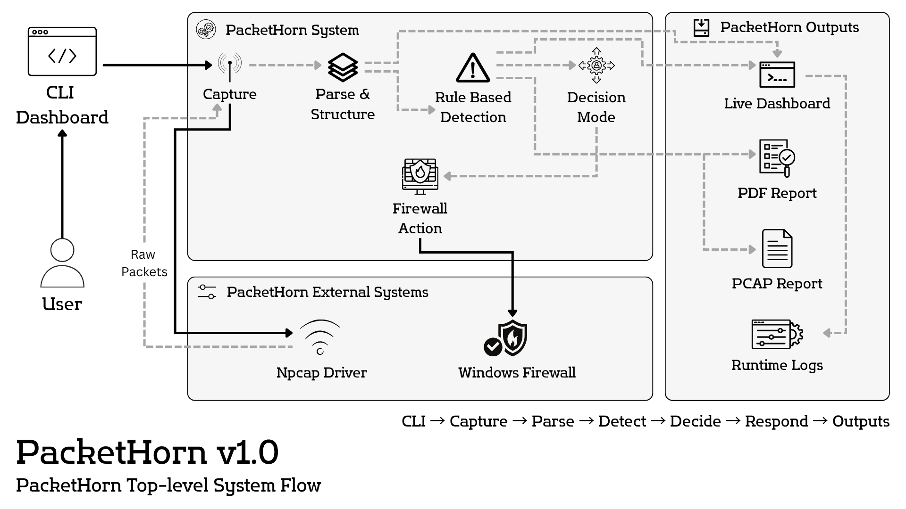

<div align="center">



<br/>

        

</div>

---

**Windows network intrusion detection and response — terminal-native, rule-driven and no cloud.**

PacketHorn captures live traffic on a selected interface, runs it through a signature and behavior detection engine, and optionally fires short-lived Windows Firewall block rules when threats are confirmed. Everything — captures, detections, and reports — stays local.



---

## What it does

- Captures raw packets via Npcap on any available Windows interface
- Parses and normalizes TCP, UDP, ICMP, and raw frames in a processing pipeline
- Evaluates traffic against two rule engines: **signature** (stateless flag/port matching) and **behavior** (sliding-window counters with per-source scope)
- Classifies threats at five severity levels: Info, Low, Medium, High, Critical
- Supports three response modes: AlertOnly, InteractiveBlock, AutoBlock
- In AutoBlock mode, injects timed Windows Firewall rules and removes them automatically on expiry
- Generates a PDF session report when you trigger Report from the dashboard
- Writes a Wireshark-compatible `.pcap` file per session
- Runs entirely in a Terminal.Gui dashboard — no GUI framework, no browser, no external service

---

## Dashboard

The terminal dashboard shows three concurrent views:

- **Packets** — live feed of captured frames with time, protocol, source/destination, size, and TCP flags
- **Detections** — fired rules with severity, matched source/destination, and confidence score
- **Events** — timestamped session event log

Interface selection, mode switching, and capture control are available directly from the dashboard without restarting.

---

## Requirements

- Windows 10 or 11
- .NET SDK 10.0 or later
- [Npcap](https://npcap.com/) installed (WinPcap-compatible mode recommended)
- Administrator privileges (required for packet capture and firewall response)

---

## Quick start

```powershell
# Restore and build
dotnet restore
dotnet build PacketHorn.slnx

# Launch the dashboard
dotnet run --project src/PacketHorn.CLI/PacketHorn.CLI.csproj
```

Run as Administrator, or capture and firewall features will be blocked at the OS level.

Note: there are currently no command-line flags implemented in `PacketHorn.CLI`; runtime control is provided through the terminal dashboard menu and hotkeys.

---

## Configuration

All runtime settings live in `config/packethorn.conf`.

Key options:

| Setting | What it controls |
|---|---|
| `capture.interface` | Capture interface name, index, or `AUTO` |
| `capture.promiscuous` | Enable/disable promiscuous capture |
| `capture.read_timeout_ms` | Capture read timeout in milliseconds |
| `capture.filter` | BPF-style filter expression |
| `capture.buffer_queue_size` | Internal packet queue capacity |
| `detection.mode` | `AlertOnly` / `InteractiveBlock` / `AutoBlock` |
| `firewall.block_duration_sec` | Block duration setting (currently enforced to 15 seconds at runtime) |
| `ui.use_tui` | Enable Terminal.Gui dashboard mode |
| `ui.packet_list_limit` | Max packet rows shown in dashboard |
| `ui.detection_list_limit` | Max detection rows shown in dashboard |
| `paths.rules_dir` | Rules directory |
| `paths.logs_dir` | Runtime log directory |
| `paths.pcap_dir` | PCAP output directory |
| `paths.reports_dir` | PDF report output directory |

Use `capture.interface=AUTO` to auto-select a likely primary NIC, or set an exact interface name/index.

---

## Rules

Detection logic is defined in two plain-text rule files under `rules/`.

**`signatures.rules`** — stateless, per-packet matching:
```
# NAME | PROTOCOL | DIRECTION | SRC_IP | DST_IP | PORT | FLAG_MATCH | FLAG_MASK | COUNT | WINDOW_SEC | SEVERITY | DESCRIPTION
SMB_REMOTE_PROBE | TCP | INBOUND | ANY | ANY | 445 | 0x00 | 0x00 | 20 | 30 | MEDIUM | Repeated inbound SMB connection attempts indicate lateral movement probing
SYN_STORM_SINGLE_SRC | TCP | INBOUND | ANY | ANY | ANY | 0x02 | 0x12 | 80 | 10 | HIGH | Sustained SYN without ACK from single flow suggests handshake abuse
```

**`behaviors.rules`** — stateful, sliding-window counters:
```
# NAME | PROTOCOL | DIRECTION | WINDOW_SEC | THRESHOLD | METRIC | GROUP_BY | SEVERITY | DESCRIPTION
SYN_FLOOD_CONFIRMED | TCP | INBOUND | 10 | 120 | PACKET_COUNT | SRC_IP | HIGH | Sustained high-rate TCP SYN behavior from one source indicates flood activity
PORT_SCAN_BROAD | TCP | INBOUND | 15 | 30 | UNIQUE_DST_PORTS | SRC_IP | HIGH | Single source targeting many destination ports in short interval indicates scan behavior
TRAFFIC_BASELINE_INFO | ANY | BOTH | 120 | 500 | PACKET_COUNT | SRC_IP | INFO | Informational baseline marker for sustained active network endpoints
```

Rules are loaded when capture starts. Restart capture after editing rule files.

---

## Output

During a capture session, PacketHorn writes PCAP output. PDF reports are generated on demand from the dashboard.

Configured output paths (defaults shown):

```
./logs/            runtime logs directory
./outputs/pcap/    .pcap files (Wireshark-compatible)
./outputs/reports/ PDF session reports
```

Reports include a packet volume breakdown by protocol, a ranked list of alert sources, and a full detection timeline.

---

## Architecture

PacketHorn is split into focused modules. Business logic does not live in the CLI project.

```
PacketHorn.CLI          entry point and Terminal.Gui dashboard
PacketHorn.Capture      capture interfaces and Npcap device integration
PacketHorn.Processing   packet parsing and frame normalization
PacketHorn.Detection    rule loading, signature engine, behavior engine
PacketHorn.Response     decision logic and Windows Firewall orchestration
PacketHorn.Output       session logging, PCAP writing, PDF report generation
PacketHorn.Platform     environment validation (OS, privileges, Npcap presence)
PacketHorn.Core         shared models, contracts, enums, pipeline primitives
```



---

## Dependencies

| Library | Purpose |
|---|---|
| [Npcap](https://github.com/nmap/npcap) | Raw packet capture |
| [Terminal.Gui](https://github.com/gui-cs/Terminal.Gui) | Terminal dashboard |
| [QuestPDF](https://github.com/QuestPDF/QuestPDF) | PDF report generation |

---

## Security note

PacketHorn is a detection and response tool. Test rule files in `AlertOnly` mode before enabling `AutoBlock` on any network you do not fully control. Miscalibrated behavior rules on a busy network will produce false positives. Whitelist your gateway, DNS resolver, and any monitoring hosts before enabling firewall response.

---

## License

MIT — see `LICENSE`.
